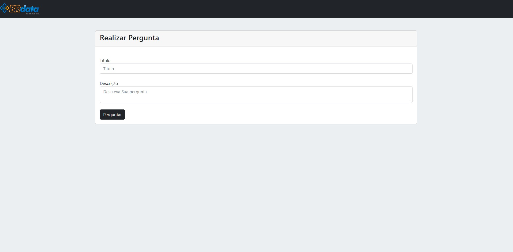

# Site de pergunta parecido com ASK pergunta ou Yahoo perguntas

Usando NodeJS e EJS como engine View.

Faço o clone do repositorio ou baixe em sua maquina.
e baixe as depedencias usando npm install

  

<h3>Pagina inicial do site</h3>
</a>  

<h3>Pagina para iniciar uma pergunta</h3>
</a> 

<h3>Pagina responder ou visulizar as respostas</h3>
</a> 

<h3>Pagina responder ou visulizar as respostas</h3>
</a> 

<h3>Como a resposta fica</h3>
</a> 

